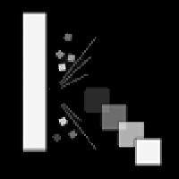

# PONG

Pong game in python with particules effects

• Wall sound: duration 16 ms, frequency 226 Hz.
• Paddle sound: duration 96 ms, frequency 459 Hz.
• Point sound: duration 257 msec, frequency 490 Hz.